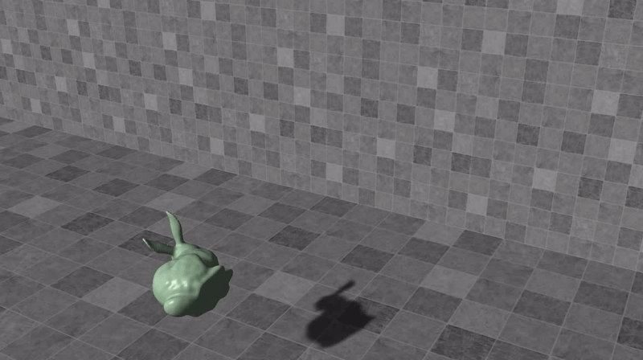

## Rigid Body Collision Detection and Response

lab1 implementation of [GAMES103](https://games-cn.org/games103/)

a rigid body dynamics solver, without using the built-in physics engine in Unity.

